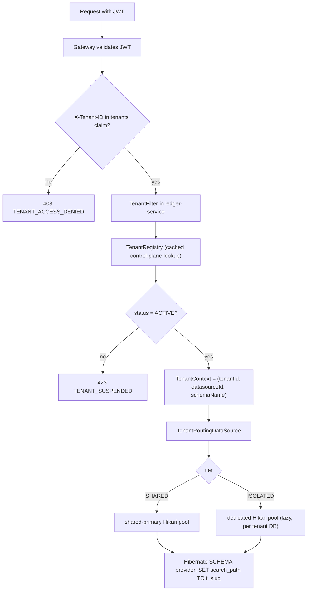
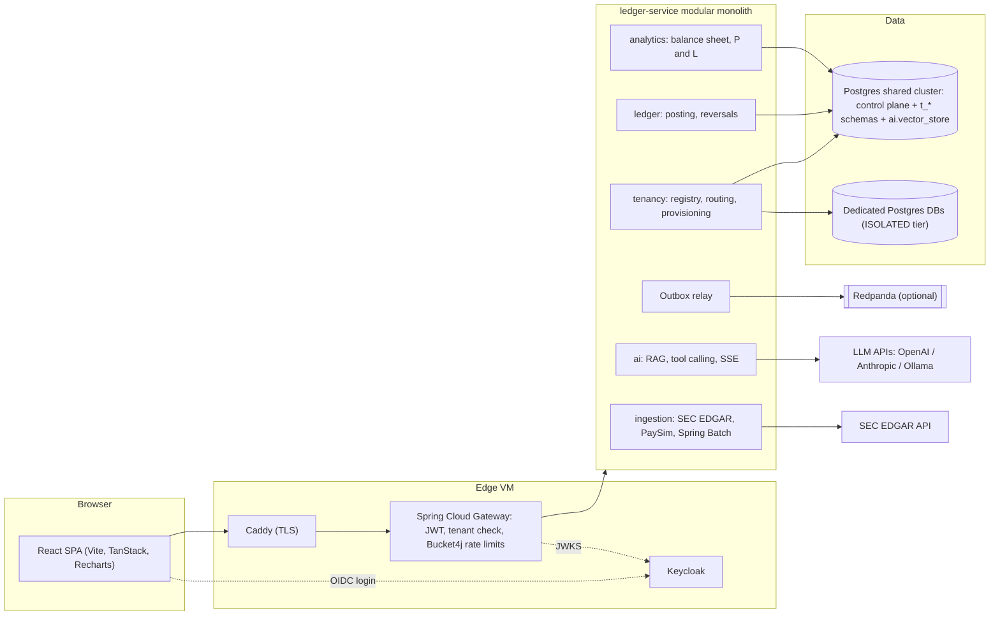
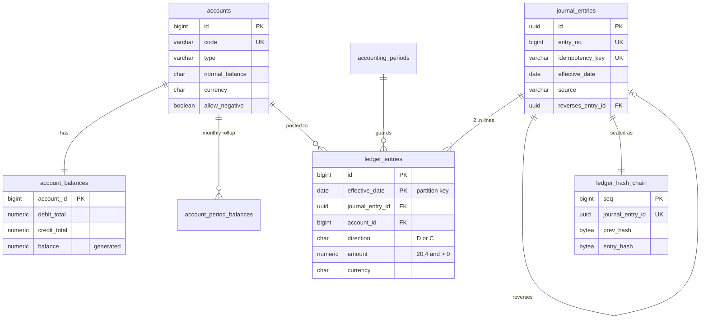
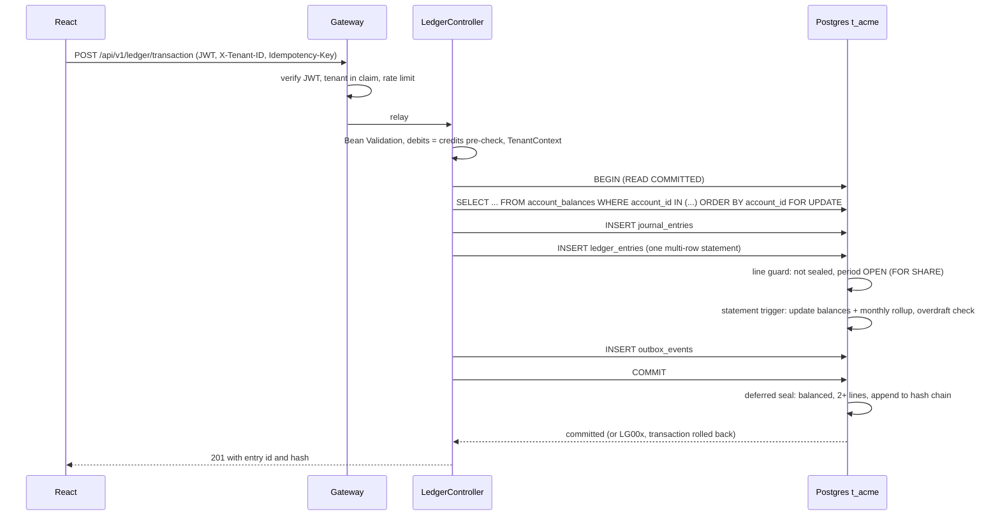

# Architecture: Multi-Tenant B2B SaaS Ledger & Financial Analytics Engine

Status: Shot 5 (ledger web). Schema: `infra/db/verify-schema.sh`. API contract: `docs/api/openapi.yaml`. E2E: `infra/scripts/e2e.sh`. Web: `frontend/`.

| Concern | Choice |
|---|---|
| Runtime | Java 21 (virtual threads). ledger-service: Spring Boot 4.1, Spring AI 2.0. gateway: Spring Boot 4.0, Spring Cloud 2025.1 (latest GA line, which supports Boot 4.0 only; both move to Boot 4.1 when Spring Cloud 2026.0 is GA) |
| Data | PostgreSQL 17 + pgvector (HNSW), Flyway |
| Tenancy | Hybrid: schema-per-tenant on a shared cluster, database-per-tenant for the ISOLATED tier |
| Identity | Keycloak (OIDC), `tenants` claim in the access token |
| Events | Transactional outbox in each tenant schema, relayed to Redpanda (optional `events` profile) |
| AI | Pluggable chat (OpenAI / Anthropic) and embeddings (OpenAI / local ONNX / Ollama) |

---

## 1. Multi-tenancy strategy

### 1.1 Schema-per-tenant vs database-per-tenant

| Criterion | Schema-per-tenant (one cluster) | Database-per-tenant |
|---|---|---|
| Infra cost per tenant | Near zero: one Postgres, one pool | One database (often one instance) + one pool each |
| Connection pressure | One shared HikariCP pool; `search_path` switched per checkout | N pools; `max_connections` becomes the scaling limit (~20 tenants per 4 GB node at 10 conns each) |
| Isolation | Logical. A bug in tenant resolution is the main risk; mitigated below | Physical. Separate files, credentials, backups, encryption keys |
| Noisy neighbours | Shared CPU/IO/buffer cache | None between tenants |
| Migrations | Flyway per schema, fast, all in one place; 1,000 schemas is fine, 50,000 is not (catalog bloat) | Flyway per database; needs orchestration and retry |
| Backup / restore of one tenant | `pg_dump -n t_acme`; point-in-time restore is cluster-wide | Native PITR per tenant |
| Compliance asks (data residency, BYOK, "our own DB") | Hard | Natural |
| Cross-tenant ops analytics | Easy (same cluster) | Needs federation |

For a cost-conscious startup the default must be schema-per-tenant: a single 4-8 GB VM can host hundreds of SMB tenants. But B2B fintech deals regularly come with "dedicated database" in the security questionnaire, and that is exactly the customer who pays for it. So we run both, behind one routing abstraction, and make the tier a per-tenant attribute that can be changed by migrating the tenant's schema to another datasource.

### 1.2 Hybrid routing model

Two independent keys are resolved for every request:

1. **Which physical database?** `tenants.datasource_id` -> `tenant_datasources` row -> HikariCP pool. All SHARED tenants point at the `shared-primary` row; each ISOLATED tenant points at its own row. This is what `AbstractRoutingDataSource` routes on.
2. **Which schema?** `tenants.schema_name` (`t_<slug>`). Hibernate's `CurrentTenantIdentifierResolver` returns it and a `MultiTenantConnectionProvider` (SCHEMA strategy) runs `SET search_path TO t_acme` on checkout and resets it on release. ISOLATED databases use the same schema name, so the code path is identical.

The control plane enforces the pairing declaratively: `tenants (datasource_id, tier)` has a composite FK to `tenant_datasources (id, kind)`, so a SHARED tenant cannot be attached to a dedicated database or vice versa, and a partial unique index guarantees a dedicated database has exactly one tenant.



### 1.3 Where the tenant comes from (and why the header can be trusted)

- Keycloak issues the access token with a `tenants` claim (list of tenant IDs the user belongs to, mapped from `tenant_memberships`). A user can belong to several tenants, which powers the workspace switcher.
- The client sends `X-Tenant-ID` to choose the active workspace. The gateway rejects the request unless the header value is in the signed `tenants` claim, then relays the token.
- `ledger-service` is also an OAuth2 resource server and re-checks the same rule (defence in depth: the service is never trusted to be reachable only via the gateway).
- `TenantContext` is a `ScopedValue`-style holder bound for the request; a `TaskDecorator` propagates it to `@Async`, Spring Batch partitions and virtual-thread executors, and clears it afterwards, so a pooled thread can never carry a stale tenant.

### 1.4 Defence in depth against cross-tenant access

| Layer | Mechanism |
|---|---|
| Token | Tenant membership is a signed claim; header must match |
| Service | Tenant resolved once per request; no repository method takes a tenant parameter |
| Connection | `search_path` set on checkout and reset on release; ISOLATED tenants are in a different database altogether |
| Database functions | Every trigger function is created with `SET search_path FROM CURRENT`, pinning it to its own tenant schema. Verified: inserting into `t_acme` while the session points at `t_globex` only touches `t_acme` |
| Vector store | Mandatory `tenant_id` metadata filter; `tenant_id` is a generated NOT NULL column with an FK to `tenants` |
| Roles (Shot 6) | The app connects as a non-owner role, so it cannot disable triggers or alter tables |

---

## 2. System architecture



Why a modular monolith behind a gateway rather than microservices: one deployable keeps the posting path to a single local transaction (no sagas for money movement), fits on one cheap VM, and the module boundaries (`ledger`, `analytics`, `ingestion`, `ai`, `tenancy`) are packages with explicit APIs, so any of them can be split out later. The gateway stays separate because rate limiting and token checks should reject abuse before it reaches the JVM that holds database connections.

Events: posting writes to `outbox_events` in the same transaction as the ledger rows; a relay drains it with `FOR UPDATE SKIP LOCKED` and publishes to Redpanda when the `events` profile is on (otherwise consumers such as the live ticker read the outbox directly via SSE). No dual-write, no lost events.

---

## 3. Data model

### 3.1 Control plane (`public`, `ai`)

| Table | Purpose |
|---|---|
| `tenant_datasources` | Physical DB targets: JDBC URL, username, `secret_ref` (`env:`/`vault:`/`file:` pointer, never a password), pool sizing, `kind` SHARED/ISOLATED |
| `tenants` | Slug, tier, `datasource_id`, `schema_name` (strict `^t_[a-z0-9_]{3,60}$`), lifecycle status, base currency |
| `users` | Keycloak `sub` -> internal user |
| `tenant_memberships` | (tenant, user, role) with roles OWNER/ADMIN/ACCOUNTANT/AUDITOR/VIEWER |
| `ai.vector_store` | Shared pgvector store, column-compatible with Spring AI `PgVectorStore`; generated `tenant_id` with FK |

### 3.2 Tenant schema (`t_<slug>`)



Also in each tenant schema: `outbox_events`, `ai_audit_logs` (query, tool calls, generated SQL + validation verdict, token usage, `query_embedding vector(N)`), and the `trial_balance` view.

Money representation: `NUMERIC(20,4)` (never floating point), amounts strictly positive with an explicit `direction`, so sign errors are impossible at the storage level. Balances are stored debit-positive (`balance = debit_total - credit_total`); presentation flips by `normal_balance`, which is explicit per account so contra accounts work.

---

## 4. Integrity: how the schema makes bad states unrepresentable

Every rule below is enforced by PostgreSQL itself, so it holds for the API, batch jobs, and anyone with a SQL console. Violations raise custom SQLSTATEs that the service maps to API error codes.

| Invariant | Enforcement | SQLSTATE |
|---|---|---|
| Debits = credits per currency, per journal entry | `DEFERRABLE INITIALLY DEFERRED` constraint trigger on `journal_entries` runs at COMMIT, after all lines exist | `LG001` |
| At least two lines per entry | Same trigger | `LG002` |
| Posted records are immutable | BEFORE UPDATE/DELETE/TRUNCATE triggers on headers, lines, chain, AI audit log; corrections are `REVERSAL` entries (`reverses_entry_id` unique: one reversal per entry) | `LG003` |
| No lines added to an already committed entry | Line guard rejects lines whose entry is already in the hash chain | `LG004` |
| No posting into a closed or unopened period | Line guard takes `FOR SHARE` on the period row | `LG005`, `LG007` |
| No overdraft on guarded accounts | Statement trigger checks `allow_negative = false` accounts after applying the batch | `LG006` |
| Line currency = account currency | Composite FK `(account_id, currency)` -> `accounts (id, currency)` | `23503` |
| Line date = header date (needed for partitioning) | Composite FK `(journal_entry_id, effective_date)` -> `journal_entries (id, effective_date)` | `23503` |
| Exactly-once posting | `idempotency_key UNIQUE` | `23505` |
| Balances always match lines | Balances are updated only by the statement-level trigger, inside the posting transaction | - |
| Tamper evidence | At seal time, `entry_hash = sha256(prev_hash || canonical(header, lines))` appended to `ledger_hash_chain`; `ledger_verify_chain()` recomputes it. Verified: a superuser bypassing triggers to edit an amount is detected | - |

### 4.1 Posting lifecycle



### 4.2 Isolation levels and locking

We deliberately do **not** run postings at SERIALIZABLE. On hot accounts (a company's main cash account touches most entries) serializable snapshot isolation produces a steady rate of `40001` aborts and retries, and none of our invariants need it, because each one is either local to the transaction's own rows or protected by an explicit row lock:

| Operation | Isolation | Why it is correct |
|---|---|---|
| Posting | READ COMMITTED + `SELECT ... FOR UPDATE` on the touched `account_balances` rows in ascending `account_id` order | Increments happen under a row lock, so no lost updates. The overdraft check reads the post-update balance while holding the lock. A single global lock order means two postings touching the same accounts in opposite directions cannot deadlock |
| Seal (at COMMIT) | Same transaction | Balanced check reads only the transaction's own lines. The chain head row is locked only for the duration of the seal, so commits serialize per tenant for microseconds, not whole transactions |
| Period close | READ COMMITTED + `UPDATE accounting_periods` | Postings hold `FOR SHARE` on their period row, so the close waits for in-flight postings to commit, and later postings see `CLOSED`. Verified: a close issued during a 3 s open posting waited for it, kept its effect, and the next posting got `LG005` |
| Reports (balance sheet, P&L, AI aggregations) | REPEATABLE READ, READ ONLY | Several queries read one consistent snapshot, so a balance sheet always balances even while postings stream in. Read-only transactions never block writers |
| Nightly reconciliation | REPEATABLE READ, READ ONLY per partition | Recompute balances from lines and compare with `account_balances`, plus `ledger_verify_chain()` |

Measured on the dev container: 16 concurrent clients posting 4,000 entries between the same two accounts in random direction: 0 deadlocks, 0 failures, ~1,100 entries/s, chain intact, balances equal to the sum of lines.

---

## 5. Indexing and partitioning

| Access path | Index / structure |
|---|---|
| Statement / balance for an account over a date range | `ledger_entries (account_id, effective_date) INCLUDE (direction, amount)` on every partition, enabling index-only scans |
| Current balance | `account_balances` primary key: O(1), no aggregation |
| Balance sheet / P&L by period | `account_period_balances (account_id, period_start)` PK and `(period_start) INCLUDE (account_id, net_change)`; a 12-month report reads (accounts x 12) rows instead of millions of lines |
| Time-ordered scans of headers | BRIN on `journal_entries.posted_at` (append-only, physically time-correlated, tiny) |
| Idempotency, external references | Unique `idempotency_key`; partial index on `(source, external_ref)` |
| Hash chain and seal checks | Unique `ledger_hash_chain.journal_entry_id` |
| Outbox relay | Partial index `outbox_events (id) WHERE published_at IS NULL` |
| Vector similarity | HNSW (`vector_cosine_ops`, m=16, ef_construction=64) on `ai.vector_store` and `ai_audit_logs` |
| Vector tenant filter | GIN `jsonb_path_ops` on `metadata` (serves Spring AI's `metadata @@ jsonpath` filters) plus btree on generated `tenant_id` |

`ledger_entries` is range-partitioned by month on `effective_date`. The tenant migration creates 24 months back and 12 months ahead; `ledger_ensure_partitions(from, to)` creates more partitions and their accounting periods and is called by ingestion jobs before loading historical data and by a monthly scheduler. Partitioning gives partition pruning for period queries, cheap per-period reconciliation, and the option to move cold years to cheaper storage.

---

## 6. AI data isolation (foundation for Shot 4)

- One shared `ai.vector_store` keeps the vector index warm and cheap. Every Spring AI search adds `Filter.Expression tenant_id == <current tenant>` (translated to `metadata::jsonb @@ '$.tenant_id == "..."'`). The database backs this up: `tenant_id` is generated from metadata, NOT NULL, and an FK to `tenants`, so an untagged or mis-tagged embedding cannot be written.
- With filtered HNSW search, small tenants could get too few results because the filter is applied after the approximate search; Shot 4 enables pgvector 0.8 iterative index scans (`hnsw.iterative_scan = relaxed_order`).
- Embedding dimension is a Flyway placeholder (`embedding_dimensions`, default 1536 for OpenAI `text-embedding-3-small`). Switching to a local model with another dimension requires a new migration and re-embedding.
- Trade-off: ISOLATED tenants' embeddings currently live in the shared store. If a customer requires embeddings to stay in their database too, Shot 4 can bind a per-datasource `VectorStore` using the same table definition.

### 6.1 AI cost controls

The project runs on small prepaid OpenAI and Anthropic credits, so spend limits are part of the design, not an afterthought:

| Rule | How it is enforced |
|---|---|
| No paid calls in tests or CI | Tests use a stubbed `ChatModel` / `EmbeddingModel`; paid providers are only wired in the `openai` / `anthropic` profiles |
| Free local development | `ollama` profile (local chat and embedding models) for everyday work; paid profiles for real runs and demos |
| Cheap models by default | Paid profiles default to the small tiers (GPT mini, Claude Haiku); larger models are opt-in via configuration |
| Embed summaries, not raw rows | Only monthly per-account/category summaries, flagged anomalies and sampled journal descriptions are embedded, never the millions of PaySim lines |
| Never embed the same text twice | Content hash in vector metadata; re-runs skip existing documents; embedding calls are batched |
| Small prompts | Tools return aggregates (tens of rows), never raw ledger dumps; output tokens are capped per request |
| Hard budget | Token usage from each response is recorded in `ai_audit_logs`; a per-tenant daily token budget plus a Resilience4j rate limiter return `429 AI_BUDGET_EXCEEDED` when exceeded |
| Repeat questions are free | Identical query + tenant + data version is served from a short-lived cache |

The one control that cannot live in code: set a monthly spending limit in the OpenAI and Anthropic billing dashboards as the final backstop.

---

## 7. Tenant provisioning

1. Insert `tenants` row (status `PROVISIONING`), plus a `tenant_datasources` row for the ISOLATED tier.
2. Run Flyway with `db/migration/tenant`, `schemas = t_<slug>` against the tenant's datasource. Each schema has its own `flyway_schema_history`, so tenants can be migrated, retried and verified independently.
3. Seed the chart of accounts, set status `ACTIVE`, evict the registry cache.

Upgrades run the same tenant migrations across all tenants in parallel batches at startup or via an admin job; a failed tenant is marked and retried without blocking the rest.

---

## 8. Shot 2: request path, security, and API

The client never talks to the database. Every tenant-scoped call follows the same path:

1. **Gateway** (`:8080`) validates the JWT (issuer, signature, audience `ledger-api`), requires `X-Tenant-ID` to appear as `/tenants/<slug>/<ROLE>` in the signed `tenants` claim, assigns `X-Request-Id`, and consumes a per-tenant Bucket4j token (a separate, much smaller bucket for `/api/v1/ai/**`).
2. **ledger-service** (`:8081`) is also a resource server and repeats the membership check, then looks the slug up in the control plane: unknown -> `TENANT_NOT_FOUND`, not `ACTIVE` -> `TENANT_UNAVAILABLE`.
3. **`TenantContext`** is bound for the request (and copied onto `@Async` / batch threads by `TenantContextTaskDecorator`). `TenantRoutingDataSource` picks the Hikari pool for `datasource_id`; Hibernate's schema provider runs `Connection.setSchema(t_<slug>)`.
4. **Method security** (`@PreAuthorize("@tenantSecurity.has('LEDGER_POST')")`) reads the role from the context, not from a header.

`X-Tenant-ID` is never rewritten from the token: a user can belong to several tenants (workspace switcher). The signed claim is the allow-list; a spoofed header for a tenant the caller is not in is `403 TENANT_ACCESS_DENIED` at the gateway, before a backend connection is used.

Admin calls (`/api/v1/admin/**`) skip the tenant header and require the realm role `PLATFORM_ADMIN`. Provisioning is idempotent: a tenant stuck in `PROVISIONING` can be retried; Flyway per schema makes that safe.

Errors are RFC 9457 `application/problem+json` with a stable `code` (`docs/api/openapi.yaml`). Database trigger SQLSTATEs `LG001`–`LG007` map onto those codes, including failures raised at COMMIT by the deferred seal trigger.

Posting is idempotent per `Idempotency-Key` (fingerprint of the canonical body): same key + same body replays (`200`, `Idempotent-Replayed: true`); same key + different body is `409 IDEMPOTENCY_KEY_REUSED`. Concurrent postings of one tenant are capped by a Resilience4j bulkhead (`TENANT_BUSY`) so one noisy tenant cannot exhaust the shared pool.

The AI route (role `AI_QUERY`, gateway AI bucket) is implemented in section 10. Tests and the default profile use a stub model; no paid API is called.

## 9. Shot 3: ingestion

External data enters through the same posting path as the API, with `journal_entries.source` set to `SEC_EDGAR` or `PAYSIM`. Re-running an import replays; it does not double-post.

**SEC EDGAR.** `POST /api/v1/admin/ingestion/sec` fetches `https://data.sec.gov/api/xbrl/companyfacts/CIK##########.json` (the URL in `PROJECT.md` is not a real endpoint). The client sends a contact `User-Agent` (`ledger.ingestion.sec.user-agent`, for example `Ledger Local dev@example.com`) and shares one Resilience4j bucket of at most 10 requests per second. Only USD `10-K` / `FY` facts are kept; a restated period keeps the latest `filed` date. The oldest year in the requested window is an opening snapshot (assets, liabilities, equity). Each later year is the change since the previous imported year, with an equity plug line when the filing does not satisfy the accounting equation. `ledger_ensure_partitions` opens any historical month before the first post. Pick the year window once: widening it later changes the old opening journal and comes back as `409 IDEMPOTENCY_KEY_REUSED`.

**PaySim.** `POST /api/v1/admin/ingestion/paysim` accepts a CSV in the Kaggle layout and returns `202` plus a job id (`GET /api/v1/admin/ingestion/jobs/{id}`). A Spring Batch 6 job splits the file into line ranges and streams each range; the file is never loaded whole. Workers post on a bounded pool, separate from the launcher thread so the two cannot deadlock. Each row is one journal in the tenant's base currency (settlement cash against a type account). The idempotency key is a hash of the file plus the line number. Customer names stay in metadata. `step` is an hour offset from `ledger.ingestion.paysim.epoch` (default: the first of the current month).

**Reconciliation.** Nightly at 02:15, and on `POST /api/v1/admin/ingestion/reconciliation`, each active tenant is read under `REPEATABLE READ` / read only. Balances and monthly rollups are recomputed from `ledger_entries` and compared, and `ledger_verify_chain()` is run. The result is stored in `public.reconciliation_runs` (`OK`, `MISMATCH`, or `FAILED`). One tenant's failure does not stop the others.

## 10. Shot 4: tenant-scoped AI audit

`POST /api/v1/ai/audit/query` answers a question about the caller's tenant. `Accept: application/json` returns the full insight. `Accept: text/event-stream` sends `token`, `finding`, and `done` events. A budget or rate-limit failure is `429` before the stream opens.

The model does not write SQL and does not see other tenants:

- Retrieval uses `ai.vector_store` with `Filter.Expression tenant_id == <current tenant>`. Only a short summary of the question and answer is embedded, and the same text is not embedded twice (content hash). New connections of the database role use `hnsw.iterative_scan = relaxed_order` when that pgvector setting is available.
- The service runs one whitelist tool for the question: spending anomalies from `account_period_balances`, or, when the question contains `readonly:`, a single SELECT. Those tools are also registered on `ChatClient`, so a real model can call `accountBalances`, `monthlyActivity`, `spendingAnomalies`, `comparePeriods`, and `runReadOnlyQuery`.
- `runReadOnlyQuery` is parsed with JSqlParser (one SELECT, ledger tables only, no system functions, no other schema) and then executed as the `ledger_ai_reader` role, which has `SELECT` only, inside a read-only transaction with `statement_timeout`.

Spend controls: a per-tenant Resilience4j limiter, a calendar-month token budget (`429 AI_BUDGET_EXCEEDED`), a bulkhead and circuit breaker around the model (`503 AI_PROVIDER_UNAVAILABLE`), a short cache for the same question and ledger version, and a cap on output tokens. Every call is appended to `ai_audit_logs`.

No profile uses the stub (`spring.ai.model.chat=none`). `openai` (gpt-4o-mini, text-embedding-3-small), `anthropic` (Claude Haiku; embeddings stay local unless you point them at OpenAI or Ollama), and `ollama` switch the model. The embedding width stays 1536 unless `LEDGER_EMBEDDING_DIMENSIONS` and a new migration change it.

## 11. Shot 5: ledger web

`frontend/` is a Vite + React + TypeScript app on port 5173. The dev server proxies `/api` to the gateway and `/realms` to Keycloak, so the browser stays on one origin. Sign-in uses the public `ledger-web` client (password = username for the demo users). The workspace switcher lists every `/tenants/<slug>/<ROLE>` in the access token; `X-Tenant-ID` follows the selection. A viewer can read and cannot post or ask.

The ledger grid virtualizes with `@tanstack/react-virtual`, so 10,000 lines mount only the rows in view. "Load 10,000-line sample" (and the unsigned preview) fills that grid locally; lines posted in the session come from `POST /api/v1/ledger/transaction`. The balance-sheet chart is Recharts over `GET /api/v1/analytics/balance-sheet`. ⌘K opens a cmdk bar that streams `POST /api/v1/ai/audit/query` as `token`, `finding`, and `done` events.

## 12. Verifying locally

```bash
docker compose -f infra/docker-compose.yml up -d --wait
RESET=1 infra/db/verify-schema.sh          # schema invariants
./gradlew test                             # Testcontainers + mock JWTs; no Keycloak, no LLM
./gradlew :ledger-service:bootRun          # :8081
./gradlew :gateway:bootRun                 # :8080
cd frontend && npm test && npm run dev     # :5173
infra/scripts/e2e.sh                       # real Keycloak tokens through the gateway
```

Demo users (realm `ledger`, password = username): `alice` (Acme accountant + Globex viewer), `bob` (Globex owner), `platform-admin`.
